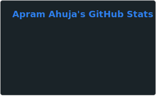
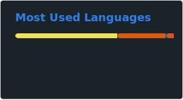

<h1 align="left">Hi 👋   I'm Apram</h1>
<!--  -->

work 

💳 Incoming SWE Intern <b>Mastercard</b>  
🧑‍🏫 4x Teaching Assistant <b>CPSC 320</b> Algorithm Design 

 

⏪ Prev  
Software Engineering Intern <b>Aquatic Informatics</b>  
Software Developer <b>UBC Emerging Media Lab</b></a>  
Infra & DevOps Intern <b>Optum (UnitedHealth Group) </b>

 building on
 

👨‍💻 DSA logs <a href= "https://github.com/apramm/SomeLeetodce" style="color:red; text-decoration:underline;">SomeLeetcode</a>  
📕 Reading logs <a href= "https://apramm.github.io/apramreads/" style="color:red; text-decoration:underline;">apram reads</a>  
🌱 upcoming projects <a href = "https://github.com/billsplittr/BillSplittr"> Split Bill </a> + deploying ubc sections  
🏃‍♂️ skills to unlock : backflip, muscle up and marathon 🤞 
✌️ visit <a href = "https://apramahuja.com/" >apramahuja.com</a> 

 

<table align="center" border="1" cellpadding="1" cellspacing="1">
  <tr>
    <td></td>
    <td></td>
    <td></td>
    <td></td>
    <td></td>
    <td></td>
  </tr>
</table>

<h3>Technologies</h3>
<table align="left" border="0" cellpadding="0" cellspacing="0">
  <tr>
    <td></td>
    <td></td>
    <td></td>
    <td></td>
    <td></td>
    <td></td>
    <td></td>
    <td></td>
    <td></td>
    <td></td>
    <td></td>
    <td></td>
    <td></td>
    <td></td>
    <td></td>
  </tr>
</table>

  
  &nbsp;&nbsp;&nbsp;&nbsp;
  

