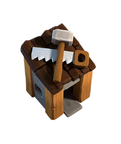

<h1 align="left">Hi 👋   I'm Apram</h1

<!--
work 

AI Engineer <b>Sahova 🪏 </b>  
Lead Teaching Assistant <b>CPSC 320 Algorithm Design </b>  

 

⏪ Prev  
SWE Intern <b>Mastercard 💳 </b>  
Software Engineering Intern <b>Veralto 💧 </b>  
Software Developer <b>UBC Emerging Media Lab 🔬 </b></a>  
Infra & DevOps Intern <b>Optum (UnitedHealth Group) 🏥 </b>
-->

<!--   -->
👨‍💻 DSAlgo <a href= "https://github.com/apramm/SomeLeetodce" style="color:red; text-decoration:underline;">SomeLeetcode</a>  
📕 Read <a href= "https://apramm.github.io/apramreads/" style="color:red; text-decoration:underline;">Apram Reads</a>  
🏃‍♂️ Marathon, Backflip and MuscleUp on <a href="https://www.strava.com/athletes/144141823">Strava</a> 
🌱 upcoming projects ???  

<!--   -->

 

<a href="apramahuja.com">apramahuja.com </a>

