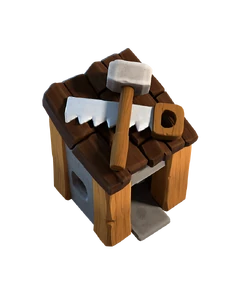

<h1 align="left">Hi 👋   I'm Apram</h1>
<!--  -->

work 

👨‍💻  Software Developer at <b>Aquatic Informatics</b>  
🧑‍🏫 Teaching Assistant for Intermediate Algorithm Design 
⪠Previous :  
Software Developer at <b>UBC Emerging Media Lab</b></a>  
Infra & DevOps Engineer Intern at <b>Optum (UnitedHealth Group) </b>

 building on
 

🔭 Winter 2026 internship   
👨‍💻 DSAlgo for interview <a href= "https://github.com/apramm/SomeLeetodce" style="color:red; text-decoration:underline;">SomeLeetcode</a>  
🌱 upcoming projects <a href = "https://github.com/billsplittr/BillSplittr"> Split Bill </a> + ubc sections  
🏃‍♂️ Aiming for sub 20 5k @GreatTrek and marathon next 🤠

✌️ To get in touch visit <a href = "https://apramahuja.com/" >apramahuja.com</a> 

 

 &nbsp;&nbsp;
  &nbsp;&nbsp;
  &nbsp;&nbsp;
 &nbsp;&nbsp;

<h3>Technologies</h3>

&nbsp;
&nbsp;
&nbsp;
&nbsp;
&nbsp;
&nbsp;
&nbsp;
&nbsp;
&nbsp;
 &nbsp;
 &nbsp; 
&nbsp; 
 &nbsp; 
&nbsp;
&nbsp;

&nbsp;

<!-- 
 -->

